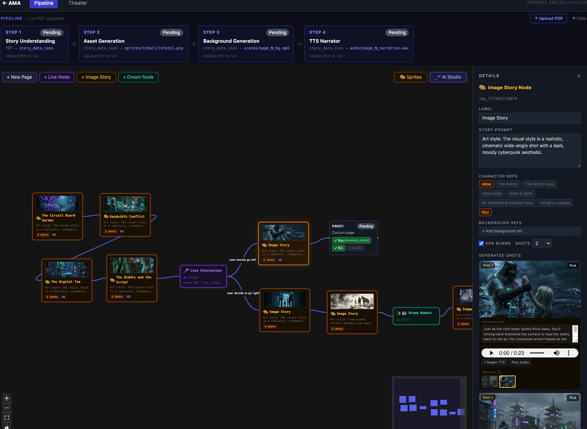
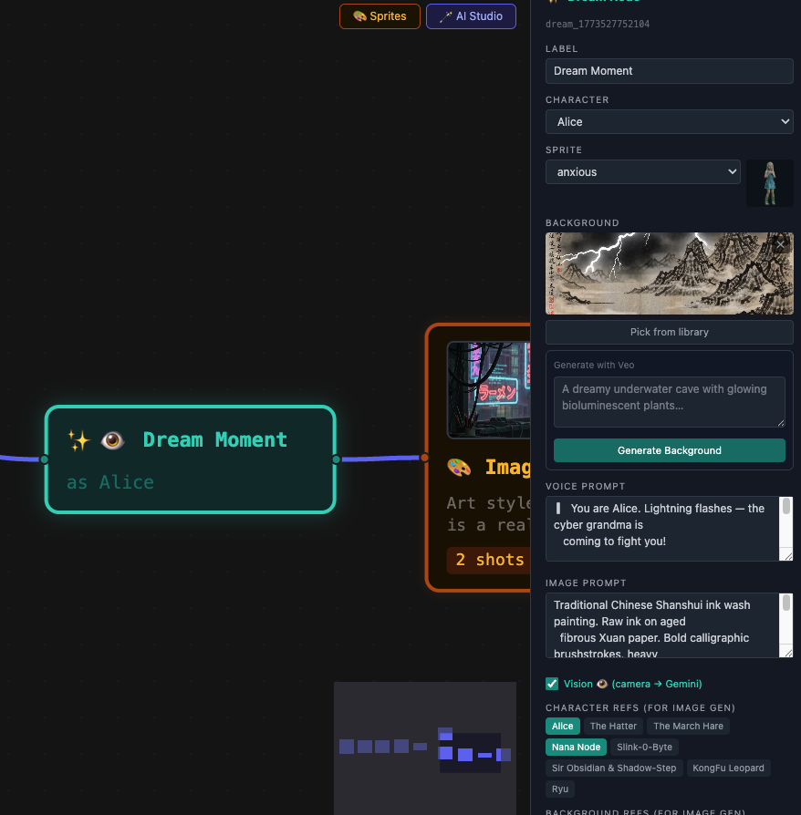
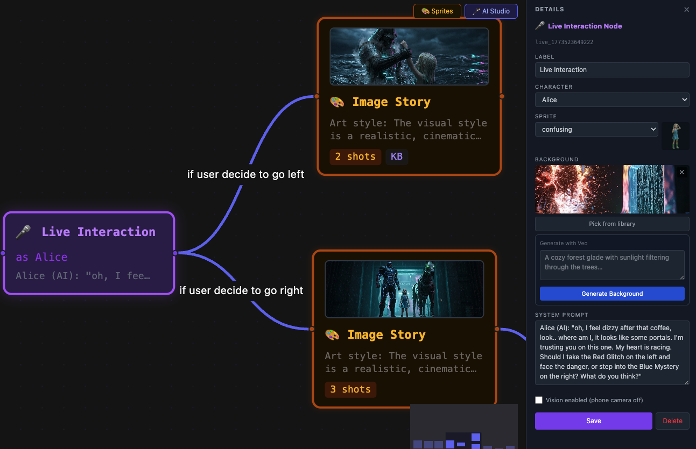
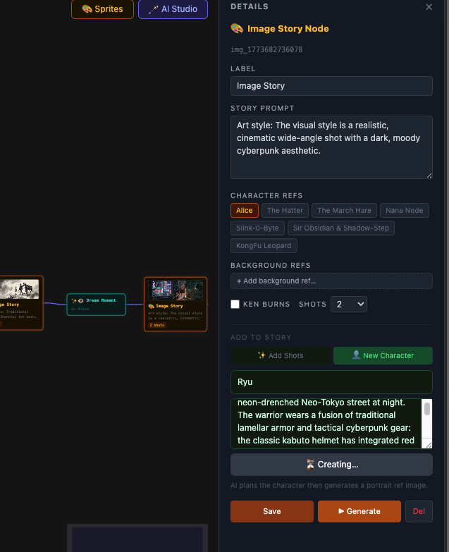
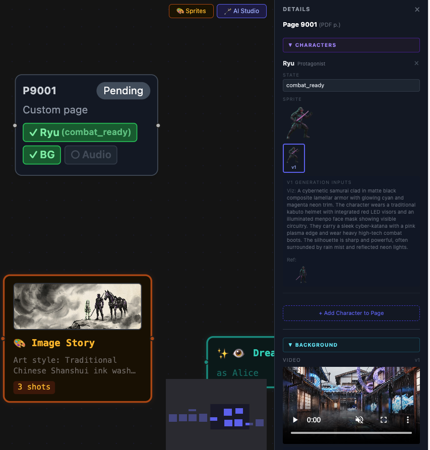
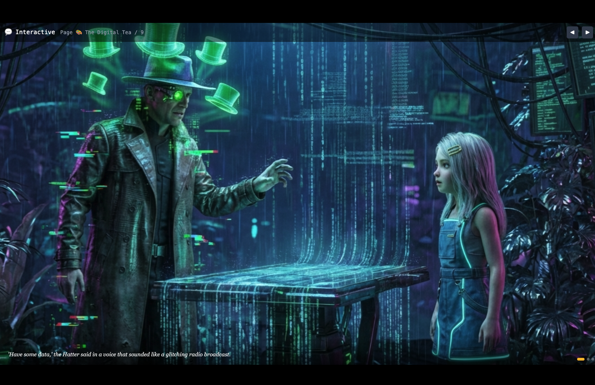
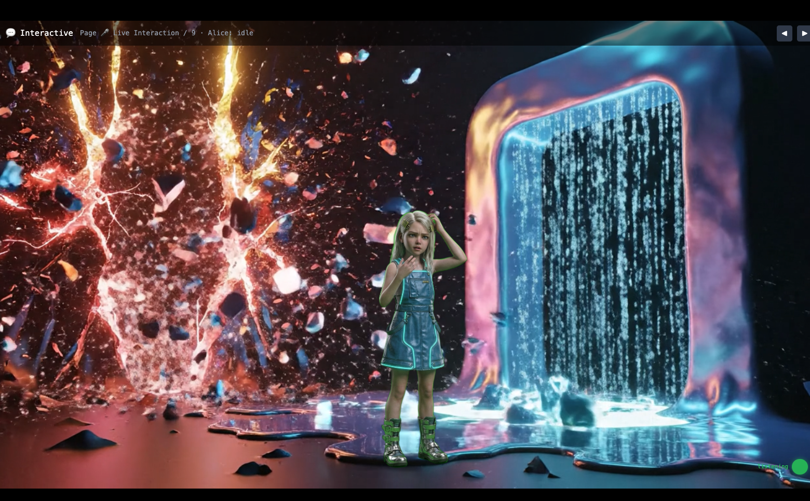

# AMA — Interactive Story Studio

> **Hackathon Submission · Gemini Live Agent Challenge 2026**
> AMA is a node-based story platform using Gemini. Creators build branching AI narratives with voice and images—no coding needed. Audiences speak to characters to shape any genre in real time.

---

## Inspiration

Every child deserves a story that feels alive — one that listens, responds, and grows with them.

We wanted to give children a truly immersive reading experience, whether the book already has illustrations or is just plain text. With AI, any story can become a rich, visual, and interactive world tailored to each child's imagination.

The spark came from the **Gemini Live API** and its interleaved generation capability. A storybook doesn't have to be static — characters can speak, react to what a child says, and branch the narrative in real time. A child's response becomes part of the story. Every read-through is a unique adventure.

But building that kind of experience is hard. Generating AI content requires orchestrating dozens of API calls — image generation, video, speech, live streaming — and there's no good tool to tie it all together. So we built one: a **studio** where creators can upload any book, generate all the multimedia assets they need, and wire everything into an interactive story graph — without writing a single line of code.

### System UI


---

## What it does

AMA has two layers that work together: a **Pipeline Editor** for creators to build stories, and a **Theater Mode** for audiences to experience them.

### 1. Pipeline Editor (Authoring Tool)

A web-based visual node editor where creators build interactive stories — no coding required:

- **Start from anything** — upload a PDF or use the AI studio interface to describe a story; Gemini reads and understands it automatically and generates the initial story graph
- **Generate multimedia assets** per node: character sprites, animated backgrounds (video via Veo), and narration audio — all powered by Google's generative AI models
- **Build a branching story graph** with drag-and-drop nodes and edges
- **Centralized asset management** — every node is an independent workstation where you create and manage its assets; all assets are shared across the project so you can reuse them freely
- **Character art consistency** — image generation uses Gemini's image reference ability, so characters look the same across every node and scene

**The story graph has four node types, each a distinct creative tool:**

<table>
  <thead>
    <tr>
      <th>Node Type</th>
      <th>Preview</th>
      <th>What it does</th>
    </tr>
  </thead>
  <tbody>
    <tr>
      <td><strong style="color:#ef4444">Dream Node</strong></td>
      <td></td>
      <td><small>Captures real-time audience input via Gemini Live, then uses <strong style="color:#ef4444">✨ Gemini Interleaved Generation</strong> to produce story text and images <em>simultaneously</em> — the story writes and illustrates itself as the child speaks</small></td>
    </tr>
    <tr>
      <td><strong>Live Node</strong></td>
      <td></td>
      <td><small>Activates Gemini Live API for real-time voice interaction; Gemini navigates story branches based on audience responses</small></td>
    </tr>
    <tr>
      <td><strong>Image Node</strong></td>
      <td></td>
      <td><small>Composes characters directly into the background using Gemini image generation — preserving art style consistency</small></td>
    </tr>
    <tr>
      <td><strong>Page Node</strong></td>
      <td></td>
      <td><small>Separates characters from the background as transparent sprites for programmatic position, scale, and movement control</small></td>
    </tr>
  </tbody>
</table>


### 2. Theater Mode (Runtime Experience)

The audience-facing stage where the story comes alive:

- **Background videos** play on loop (generated by Veo)
- **Character sprites** animate with emotional states (idle, happy, surprised, and more)
- **Narration audio** plays synchronized with visuals
- **Gemini Live agent** listens to and watches the audience, speaking as the story character in real time
- **Branching navigation** — Gemini decides which story branch to take based on what the audience says or does
- **Dream sequences** — the audience describes something imaginary; Gemini generates a live storyboard and narrates it as images stream in

### Theater mode
1. image with tts


2. live node: theater mode with live api listen to audience 



---

## How we built it

### Architecture

> *An architecture diagram image will be inserted here. The diagram below represents the data flow and system layers.*

```
┌───────────────────────────────────────────────────────────────┐
│                  FRONTEND  (React 19 + TypeScript)            │
│                                                               │
│  ┌─────────────────────────┐   ┌─────────────────────────┐   │
│  │   Pipeline Editor        │   │      Theater Mode        │   │
│  │  (XYFlow Node Graph)     │   │  (Pixi.js + WebSocket)  │   │
│  │  Asset generation UI     │   │  Live agent playback    │   │
│  └──────────┬──────────────┘   └──────────┬──────────────┘   │
└─────────────┼──────────────────────────────┼─────────────────┘
              │  REST API                    │  WebSocket
              ▼                              ▼
┌───────────────────────────────────────────────────────────────┐
│                  BACKEND  (FastAPI + Python 3.12)             │
│                                                               │
│  Pipeline Stages (Authoring):                                │
│   1. Story Understanding  →  Gemini 3 Flash (text)           │
│   2. Sprite Generation    →  Gemini 3 Pro Image              │
│   3. Background Video     →  Veo 3.1  (2 RPM · 10 RPD)      │
│   4. TTS Narration        →  Gemini 2.5 Flash TTS            │
│                                                               │
│  Real-Time (Theater):                                        │
│   · Gemini Live API  →  native audio + vision + tool-calling │
│   · Tool: navigate_to(node_id)  →  story graph traversal     │
│   · Camera stream   →  1 FPS JPEG  →  vision-based branches  │
│   · Dream tool      →  generate_dream()  →  live storyboard  │
└─────────────────────────────┬─────────────────────────────────┘
                              │
                              ▼
               Google Cloud / Vertex AI APIs
       (Gemini · Veo · TTS · Secret Manager · Cloud Run · GCS)
```

### Tech Stack

| Layer | Technology |
|-------|-----------|
| **Frontend** | React 19.2, TypeScript, Vite, TailwindCSS 4 |
| **Node Graph Editor** | XYFlow 12 |
| **Sprite Rendering** | Pixi.js 8 (WebGL) |
| **Backend** | FastAPI 0.115, Python 3.12, asyncio |
| **Package Manager** | `uv` (fast Python packaging) |
| **Story Understanding** | Gemini 3 Flash |
| **Image Generation** | Gemini 3 Pro Image |
| **Video Generation** | Veo 3.1 |
| **Text-to-Speech** | Gemini 2.5 Flash TTS |
| **Live Real-Time** | Gemini 2.5 Flash Live (audio + vision) |
| **Infra** | Google Cloud Run (Gen 2), GCS, Terraform, Cloud Build |
| **Background Removal** | `rembg` (ONNX, baked into Docker image) |

### Key Design Decision: Two-Layer Architecture

We made a deliberate choice to separate **authoring** (pipeline) from **runtime** (live agent):

- **Pipeline stage**: all expensive generative assets (video, sprites, audio) are pre-generated and stored, so the child never waits for generation
- **Live stage**: Gemini only handles real-time conversation and navigation decisions — everything else is instant playback

This gives us **zero-latency narrative** — the AI doesn't think about the plot, only about how to react to the child.

---

## Challenges we ran into

**1. Gemini's interleaved multimodal output is fragile — we had to prove it first**

Before building Dream Nodes, we ran a dedicated experiment series to validate what the Gemini API actually supports versus what the documentation claims. The results were sobering:

- **TEXT + IMAGE interleaving works — but only with careful prompting.** In multi-turn chat, once image history accumulates, the model silently drops all text output and returns images only. Sending more than one reference image on the first turn triggers the same failure. Fix: explicitly instruct `"Respond with the scene text first, then the illustration."` in every prompt, and switch from streaming to non-streaming calls for multi-image turns.
- **TEXT + VIDEO in a single call is impossible.** `"VIDEO"` is not a valid `response_modalities` value — the API returns a hard 400 immediately.
- **TEXT + AUDIO interleaving causes hallucination.** The model understood it should produce audio, but invented a fake `<tool_call>` TTS function and returned zero audio bytes. It knows *what* to do but fakes *how* to do it.

The conclusion: **Gemini's claim of unified TEXT + VIDEO + AUDIO in one call is inaccurate.** We had to abandon the idea of a single omnibus generation call and instead orchestrate separate purpose-built APIs in sequence — Flash for text, Pro Image for illustration, Veo for video, and the TTS pipeline for audio. This experiment report directly shaped our two-layer pipeline architecture.

**2. Gemini SDK blocking the event loop**
The Google GenAI SDK makes synchronous blocking calls internally. Wrapping them naively inside FastAPI's async routes deadlocked the server. We fixed this with `asyncio.to_thread()` to offload blocking calls without freezing the event loop.

**3. Veo 3 rate limits (2 RPM, 10 RPD)**
Video generation is powerful but slow and heavily rate-limited. We built an asset versioning and reuse system so creators never have to regenerate a background unless they intentionally want to — the version picker lets them choose the best generated video across multiple runs.

**4. Character art consistency with reference images**
More reference images do not help — they hurt. Our experiments showed that sending 3 reference images caused the model to hallucinate character details and drop text output entirely. We settled on a single reference image per generation call combined with explicit style instructions to keep characters visually consistent across scenes.

**5. Character persona consistency across branching**
When a child navigates to a different story branch, how does Gemini maintain the character's personality and memory? We designed a "Context Packet" — a dynamic summary of the character's journey injected into the system prompt on every page transition. This remains an active area of refinement.

**6. Per-page asset versioning complexity**
Our initial storage model used global version counters per character. As story branching was added, this broke — a sprite version relevant on page 4 might not be correct for page 7. We redesigned to per-page, per-asset version tracking stored in `meta.json`.

**7. Background removal cold start**
`rembg` downloads a ~87MB ONNX model on first use. On Cloud Run with a cold start, this caused 30+ second delays. We baked the model into the Docker image so it is always available from the first request.


---

## Accomplishments that we're proud of

- **Full end-to-end pipeline**: upload a PDF → generate assets → build a branching story → play it live with a real-time AI character. It all works.
- **Dream Nodes**: a child says "I have a pet dragon" and within ~30 seconds Gemini has generated a 3-scene storyboard showing the dragon's adventure, narrating it live while images stream in. This felt genuinely magical in testing.
- **Zero-latency playback**: by pre-generating all assets in the pipeline stage, the theater experience has no loading screens or generation pauses — page transitions are instant.
- **Production-grade infrastructure**: Terraform IaC, Secret Manager, GCS FUSE mount, Cloud Build CI/CD, and Cloud Run Gen 2 — the whole stack is reproducible with a single `./deploy.sh` command.
- **Visual node editor**: the XYFlow-based pipeline editor lets non-technical storytellers see their story structure as a graph and modify it visually — no JSON editing required.

---

## What we learned

- **Gemini Live API is more than a voice chat** — the combination of native audio, real-time vision, and tool-calling makes it a genuine AI director capable of understanding context and making decisions, not just responding to prompts.
- **Pre-generation is the right split point** — separating deterministic asset generation from real-time agent behavior is the key to a smooth experience. Trying to generate assets during live interaction kills immersion.
- **Rate limits shape product design** — Veo's 10 requests/day limit forced us to think about asset reuse as a first-class feature, which actually made the authoring tool better.
- **Children as users require different trust models** — the AI "hallucinating" story details is actually fine (it adds to the magic). The standard "AI mistakes are costly" assumption doesn't apply when the domain is creative play.
- **Infrastructure-first matters for hackathons too** — having Terraform and `deploy.sh` set up early meant we never lost time to deployment issues during crunch time.

---

## What's next for AMA — Interactive Story Studio

**Near term:**
- **Better persona consistency** — implement the full "Context Packet" system so Gemini carries rich character memory across all branches of the story graph
- **Faster Dream Nodes** — reduce the ~30s wait for imagination generation using streaming interleaved output and background preprocessing
- **Physical projection mode** — connect to a projector and add OpenCV hand-tracking so children can "touch" characters on the wall

**Medium term:**
- **Music generation** — integrate Lyria (Google's music generation model) to generate adaptive background music that responds to story mood
- **Text-to-story ingestion** — allow creators to paste plain text (not just PDFs) to bootstrap a story graph automatically
- **Multiplayer** — support multiple children in the same room, with Gemini managing a group dynamic instead of one-on-one

**Longer term:**
- **Projector + camera calibration** — full spatial mapping so characters can be projected to specific locations on a wall and respond to the child's physical position
- **Any-book generalization** — point a camera at any physical picture book; Gemini extracts characters and builds a live story graph on the fly (the original LuminaPages vision)
- **Model routing** — use smaller/cheaper models (Flash) for simple narration, reserve more capable models for complex branching decisions, reducing cost per session

---

## Architecture Overview

> Replace the placeholder below with your architecture diagram image.

```
[ Insert architecture.png here ]
```

The architecture has three major zones:

1. **Authoring Zone** — Creator uses the Pipeline Editor to upload content, trigger asset generation, and build the story graph. All generated assets are stored in GCS.

2. **Runtime Zone** — The Theater Mode client loads pre-generated assets and opens a WebSocket to the backend. The Gemini Live agent receives audio/video from the child and uses tool-calling to navigate the story graph.

3. **Infrastructure Zone** — Cloud Run (Gen 2) hosts the FastAPI backend with GCS FUSE for storage. Terraform manages all cloud resources. Secret Manager holds the API key.

---

## How to Run

### Prerequisites

- Python 3.12+
- Node.js 18+
- A [Gemini API key](https://aistudio.google.com/apikey)

### Local Development

**Backend:**
```bash
cd AMA/backend

# Copy environment template and add your API key
cp .env.example .env
# Edit .env: set GEMINI_API_KEY=your_key_here

# Install dependencies with uv (fast Python package manager)
pip install uv
uv sync

# Start the server (mock mode on by default — no real API calls)
uv run uvicorn main:app --reload --port 8000
```

The backend will be available at `http://localhost:8000`.

**Frontend:**
```bash
cd AMA/frontend

npm install
npm run dev
```

The app will be available at `http://localhost:5173`. The dev server proxies API calls to `localhost:8000`.

### Environment Variables

Create `AMA/backend/.env`:

```env
GEMINI_API_KEY=your_gemini_api_key_here

# Mock mode (default: true) — uses test fixtures, no real API calls
# Set to false to use real Gemini/Veo models
MOCK_MODE=true

# Vertex AI (optional) — use Vertex AI instead of Gemini API directly
GOOGLE_GENAI_USE_VERTEXAI=false
# GOOGLE_CLOUD_PROJECT=your-gcp-project-id
# GOOGLE_CLOUD_LOCATION=us-central1
```

> **Start with `MOCK_MODE=true`** to explore the app without spending API credits. Switch to `false` when you're ready to generate real assets.

### Using the App (Local)

1. Open `http://localhost:5173`
2. Create a new project or upload a PDF storybook
3. In the Pipeline Editor, run each stage in order:
   - **Story Understanding** → extracts pages, characters, and structure
   - **Sprite Generation** → creates character PNG sprites
   - **Background Generation** → generates video loops (watch Veo rate limits!)
   - **TTS Narration** → generates audio for each page
4. Click on any story node to edit its assets, script, and characters
5. Add edges between nodes to create branching paths
6. Switch to **Theater Mode** and select a starting node to play

---

## How to Deploy

### Prerequisites

```bash
# Install tools
brew install terraform gcloud

# Authenticate with Google Cloud
gcloud auth login
gcloud auth application-default login
gcloud config set project geminiliveagent-489401
```

### One-Command Deploy

```bash
cd AMA

# Set your API key (never commit this to git)
export GEMINI_API_KEY="your-gemini-api-key"

# Deploy everything
./deploy.sh
```

The script automates:
1. Push `GEMINI_API_KEY` to Google Secret Manager
2. Run Terraform to enable GCP APIs and create Artifact Registry
3. Build the React frontend (with Cloud Run URL baked in)
4. Build and push the Docker image via Cloud Build
5. Run full Terraform apply (Cloud Run, GCS bucket, IAM, service accounts)
6. On first deploy: rebuild frontend with real URL and redeploy

When done, the script prints:
```
✅ Done!
   App    : https://ama-api-xxxx.run.app
   Health : https://ama-api-xxxx.run.app/api/health
```

### Infrastructure Details

| Resource | Details |
|----------|---------|
| **Cloud Run (Gen 2)** | 2 CPU, 4 GB RAM, 0–3 instances, GCS FUSE mount |
| **GCS Bucket** | Stores all project data and generated assets |
| **Artifact Registry** | Docker image storage (`us-central1`) |
| **Secret Manager** | `gemini-api-key` secret (never in env vars) |
| **Cloud Build** | Builds Docker image on `e2-highcpu-8` |
| **Region** | `us-central1` |
| **GCP Project** | `geminiliveagent-489401` |

### Manual Terraform (Advanced)

```bash
cd AMA/infra

# Initialize
terraform init

# Preview changes
terraform plan

# Apply
terraform apply
```

### Useful Commands

```bash
# View Cloud Run logs
gcloud run services logs read ama-api --region=us-central1

# Check health
curl https://your-cloud-run-url.run.app/api/health

# Update secret (rotate API key)
echo -n "new-key" | gcloud secrets versions add gemini-api-key --data-file=-
```

---

## Project Structure

```
AMA/
├── backend/
│   ├── main.py              # FastAPI app entry point
│   ├── config.py            # Model names, env vars, paths
│   ├── storage.py           # File-based persistence (project data)
│   ├── jobs.py              # Async job queue for pipeline stages
│   ├── routes/
│   │   ├── projects.py      # Project CRUD
│   │   ├── pipeline.py      # Asset generation triggers
│   │   ├── live.py          # WebSocket: Gemini Live agent
│   │   ├── dream.py         # WebSocket: Dream node generation
│   │   ├── assets.py        # Asset library management
│   │   └── camera.py        # Camera stream subscription
│   └── pipeline/
│       ├── story.py         # Stage 1: PDF → story structure
│       ├── assets.py        # Stage 2: sprite generation
│       ├── background.py    # Stage 3: Veo video generation
│       └── tts.py           # Stage 4: narration audio
│
├── frontend/
│   └── src/
│       ├── pages/
│       │   ├── ProjectsPage.tsx     # Project list
│       │   ├── PipelinePage.tsx     # Node graph editor
│       │   └── TheaterPage.tsx      # Live story playback
│       └── components/
│           ├── pipeline/            # Node editor components
│           └── theater/             # Playback + live session
│
├── infra/                   # Terraform IaC (Cloud Run, GCS, IAM)
├── deploy.sh                # One-command deployment script
└── Dockerfile               # Multi-stage build (frontend + backend)
```

---

## Built With

- [Google Gemini Live API](https://ai.google.dev/gemini-api/docs/live) — real-time audio + vision + tool-calling
- [Veo 3.1](https://deepmind.google/technologies/veo/) — video background generation
- [Gemini 2.5 Flash TTS](https://ai.google.dev/gemini-api/docs/speech-generation) — character voice narration
- [React](https://react.dev/) + [Vite](https://vitejs.dev/) — frontend framework
- [XYFlow](https://xyflow.com/) — visual node graph editor
- [Pixi.js](https://pixijs.com/) — WebGL sprite rendering
- [FastAPI](https://fastapi.tiangolo.com/) — async Python backend
- [Google Cloud Run](https://cloud.google.com/run) — serverless container hosting
- [Terraform](https://www.terraform.io/) — infrastructure as code
